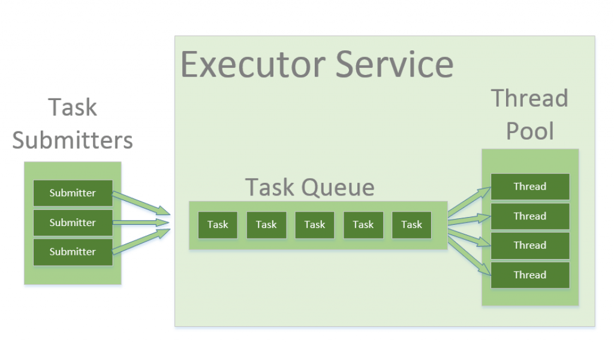

#### Thread Life Cycle

NEW – a newly created thread that has not yet started the execution

RUNNABLE – either running or ready for execution but it's waiting for resource allocation

BLOCKED – waiting to acquire a monitor lock to enter or re-enter a synchronized block/method

WAITING – waiting for some other thread to perform a particular action without any time limit

TIMED_WAITING – waiting for some other thread to perform a specific action for a specified period

TERMINATED – has completed its execution

